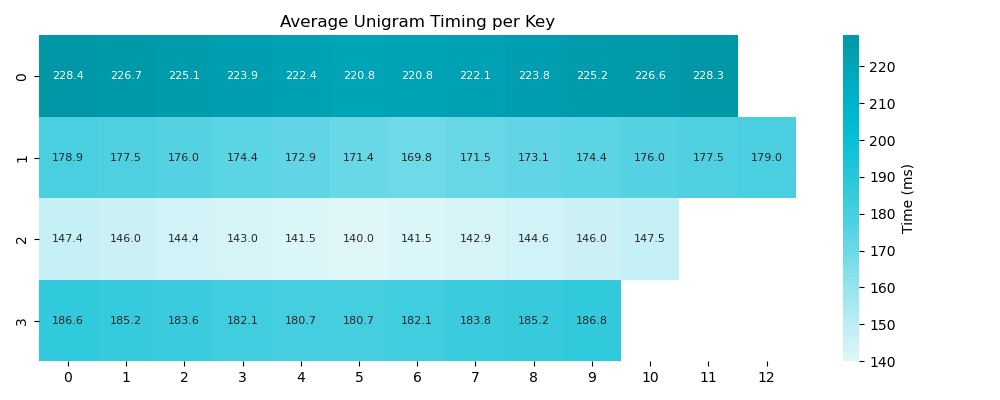
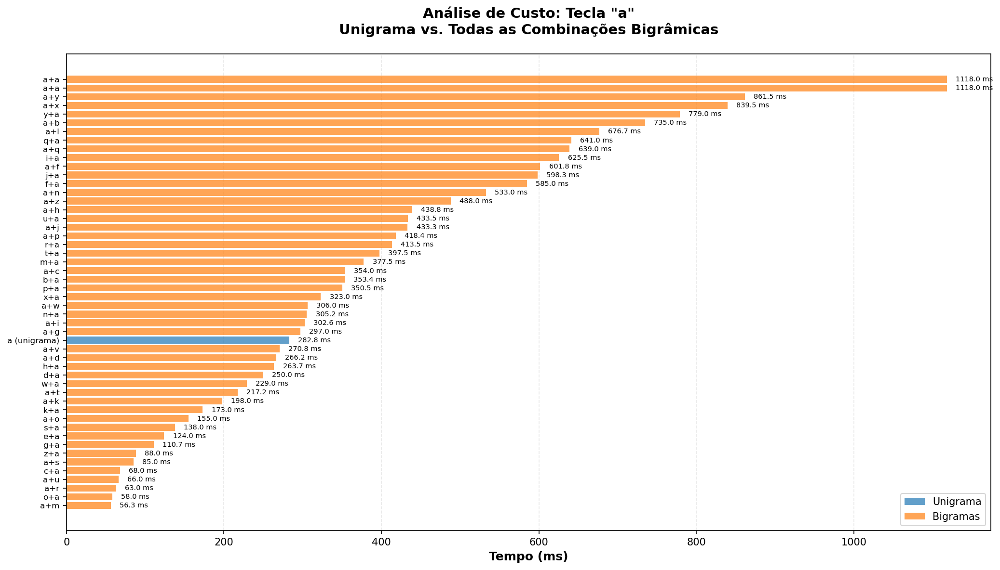
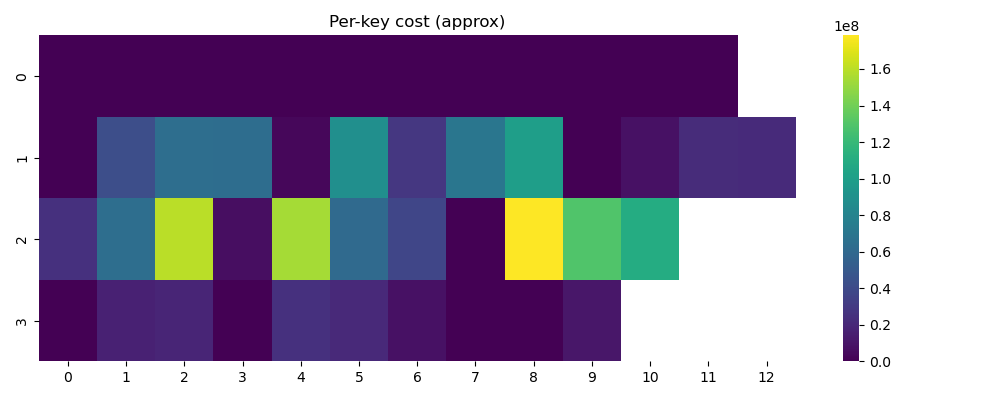
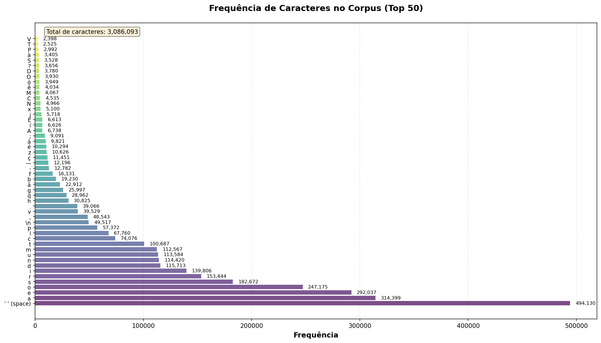

##  Visão Geral

O projeto BagreType coleta dados empíricos de digitação através da plataforma [bagretype.com](https://bagretype.com) e utiliza algoritmos genéticos para otimizar layouts de teclado. Este guia explica cada visualização e como interpretá-la.
 
De maneira simples, o projeto se trata da coleta te tempos de resposta de usuarios para apertar teclas unicas e combinacoes de 2-3 teclas. Com esses dados podemos computar o "gasto" fisico de digitar qualquer corpora de texto dado.

---

##  Gráficos e Visualizações

### 1. Gráfico de Frequência de Caracteres do Corpus

**Arquivo**: [tabela](outputs/corpus_character_frequencies.txt)

**O que mostra**: Frequência de ocorrência de cada caractere no corpus de texto utilizado para otimização.

**Por que é importante**: 
- Define quais caracteres são mais críticos para otimizar
- Caracteres frequentes (ex.: 'a', 'e', 'i' em português) têm maior impacto no custo total
- Permite validar que o corpus representa o uso real do idioma

**Comando para gerar**:
```bash
python -m ga_keyboard.corpus_stats \
  --corpus data/machado.txt \
  --out-txt outputs/corpus_character_frequencies.txt \
  --out-png outputs/corpus_character_frequencies.png \
  --top-n 50
```

1. **Contexto**: "Este gráfico mostra a distribuição de frequência dos caracteres no nosso corpus. Usamos textos de Machado de Assis como representativo do português brasileiro."
2. **Observação chave**: "Note que as vogais (a, e, i, o, u) aparecem no topo—isso significa que otimizar essas teclas terá impacto significativo no tempo total de digitação."
3. **Conclusão**: "O corpus contém [X] caracteres únicos e [Y] caracteres totais, fornecendo uma base estatística robusta para otimização."

---

### 2. Heatmap de Tempos de Unigramas

**Arquivo**: `unigram_timing_heatmap.png`


**O que mostra**: Tempo médio (em milissegundos) para pressionar cada tecla física individualmente, baseado em dados empíricos coletados.

**Por que é importante**:
- Identifica quais posições físicas são mais rápidas/lentas
- Revela padrões biomecânicos: teclas na home row (fileira central) tendem a ser mais rápidas

**Comando para gerar**:
```bash
python -m ga_keyboard.main \
  --csv data/typing_test.csv \
  --corpus data/machado.txt \
  --generations 10 \
  --population 20
# O heatmap é gerado automaticamente em outputs/unigram_timing_heatmap.png
```

1. **Contexto**: "Este heatmap mostra os tempos médios medidos empiricamente para pressionar cada tecla física. Os dados foram coletados através da plataforma BagreType, onde participantes digitaram caracteres individuais."
2. **Cores e valores**: "Cores mais escuras (valores maiores no gráfico) indicam teclas mais lentas. Veja que os números na primeira fileira tendem a ser mais lentos que as letras da home row."
3. **Validação**: "Isso faz sentido ergonomicamente: a home row é onde os dedos repousam naturalmente, então essas teclas são mais rápidas de acessar."
4. **Dados coletados**: "Temos [X] medições de unigramas, coletadas de [Y] participantes através de [bagretype.com](https://bagretype.com)."

---

### 3. Heatmap de Tempos de Bigramas

**Arquivo**: `bigram_timing_heatmap.png`


**O que mostra**: Tempo médio para digitar bigramas (pares de teclas) onde cada tecla física aparece, calculado como média de todos os bigramas envolvendo essa tecla.

**Por que é importante**:
- Captura a dificuldade de transições entre teclas
- Algumas teclas são rápidas isoladamente, mas lentas em certas combinações
- Essencial para otimizar layouts: o algoritmo precisa considerar transições, não apenas teclas individuais

**Comando para gerar**:
```bash
# Mesmo comando do anterior - ambos os heatmaps são gerados
python -m ga_keyboard.main \
  --csv data/typing_test.csv \
  --corpus data/machado.txt \
  --generations 10 \
  --population 20
```

1. **Contexto**: "Enquanto o heatmap de unigramas mostra o tempo de teclas isoladas, este mostra o custo médio de bigramas envolvendo cada tecla. Isso captura a dificuldade de transições."
2. **Diferença fundamental**: "Uma tecla pode ser rápida sozinha, mas lenta em certas combinações—por exemplo, repetir a mesma tecla ('aa') é mais lento que alternar entre teclas diferentes."
3. **Dados**: "Temos [X] medições de bigramas, coletadas quando participantes digitaram sequências de dois caracteres na plataforma BagreType."
4. **Relevância**: "O algoritmo genético usa esses dados para otimizar layouts que minimizam o tempo total, considerando não apenas teclas individuais, mas também as transições comuns no corpus."

---

### 4. Análise de Custo de uma Tecla Específica

**Arquivo**: `outputs/key_cost_analysis_[tecla].png` (ex.: `key_cost_analysis_a.png`)


**O que mostra**: Gráfico de barras comparando o tempo do unigrama de uma tecla específica com todos os bigramas que a envolvem (como primeira ou segunda tecla).

**Por que é importante**:
- Visualização detalhada do custo de uma tecla específica
- Mostra quais combinações são mais problemáticas
- Útil para análise de layout evoluído: identificar por que certas teclas foram posicionadas onde estão

**Comando para gerar**:
```bash
# Para a tecla 'a'
python scripts/analyze_key_cost.py \
  --csv data/typing_test.csv \
  --csv-json-col typing_data \
  --key a \
  --out outputs/key_cost_analysis_a.png

# Com mesclagem de dados
python scripts/analyze_key_cost.py \
  --csv data/other_data.csv \
  --key e \
  --mix-with-typing-test \
  --out outputs/key_cost_analysis_e.png
```

1. **Contexto**: "Este gráfico aprofunda a análise de uma tecla específica—vamos ver a tecla 'a' como exemplo."
2. **Estrutura**: "A barra azul mostra o tempo do unigrama (tecla sozinha). As barras laranjas mostram todos os bigramas envolvendo essa tecla, ordenados do mais rápido ao mais lento."
3. **Insights**: "Veja que 'a' + 'a' (repetição) é mais lento que 'a' + outras teclas. Isso explica por que o algoritmo genético evita colocar vogais frequentes em posições que geram muitas repetições."
4. **Aplicação**: "Quando analisamos o layout evoluído, podemos usar este tipo de gráfico para entender por que certas decisões foram tomadas."

---

### 5. Evolução da Aptidão (Fitness)

**Arquivo**: `outputs/fitness.png`


**O que mostra**: Curva de evolução da melhor aptidão ao longo das gerações do algoritmo genético.

**Por que é importante**:
- Valida que o algoritmo está convergindo (melhorando)
- Mostra a taxa de melhoria
- Identifica se mais gerações seriam benéficas (plateau sugere convergência)

**Comando para gerar** (gerado automaticamente pelo main):
```bash
python -m ga_keyboard.main \
  --csv data/typing_test.csv \
  --corpus data/machado.txt \
  --generations 300 \
  --population 200 \
  --mutation-rate 0.1 \
  --crossover-rate 0.7 \
  --elitism 5
```

1. **Contexto**: "Este gráfico mostra a evolução da aptidão (fitness) do melhor indivíduo ao longo de [300] gerações. A aptidão é o inverso do custo—quanto maior, melhor."
2. **Tendência**: "Veja que a curva começa baixa e sobe rapidamente nas primeiras gerações, depois estabiliza. Isso indica que o algoritmo está encontrando boas soluções."
3. **Convergência**: "Após aproximadamente [X] gerações, a curva atinge um plateau, sugerindo que o algoritmo convergiu para uma solução próxima do ótimo local."
4. **Parâmetros**: "Usamos população de 200, taxa de mutação de 10%, taxa de crossover de 70% e preservamos os 5 melhores indivíduos (elitismo)."

---

### 6. Heatmap de Custo por Tecla do Layout Evoluído

**Arquivo**: `outputs/heatmap.png`


**O que mostra**: Custo aproximado por tecla física no layout evoluído, baseado na frequência no corpus e nos tempos medidos.

**Por que é importante**:
- Identifica quais posições no layout evoluído são mais "caras" (problemáticas)
- Compara com o QWERTY para validar melhorias
- Mostra como o algoritmo distribuiu caracteres frequentes em teclas rápidas

**Comando para gerar** (gerado automaticamente pelo main):
```bash
# Mesmo comando do fitness - o heatmap é gerado automaticamente
python -m ga_keyboard.main \
  --csv data/typing_test.csv \
  --corpus data/machado.txt \
  --generations 300 \
  --population 200
```

1. **Contexto**: "Este heatmap mostra o custo aproximado por tecla física no layout evoluído. O custo é calculado multiplicando a frequência de uso (do corpus) pelo tempo de digitação (dos dados empíricos)."
2. **Interpretação**: "Cores mais escuras indicam maior custo. O algoritmo genético tentou minimizar o custo total, então caracteres frequentes deveriam estar em teclas rápidas (cores claras)."
3. **Validação**: "Compare com o QWERTY: no layout evoluído, vemos que as vogais (frequentes) estão em posições de cores mais claras, indicando que foram colocadas em teclas rápidas."
4. **Limitações**: "Este é um cálculo aproximado que distribui o custo de bigramas igualmente entre as duas teclas envolvidas. Serve como visualização qualitativa."

---

##  Metodologia de Coleta de Dados

### Plataforma BagreType

**URL**: [bagretype.com](https://bagretype.com)

**Repositório**: [github.com/SamuelMFS/BagreType](https://github.com/SamuelMFS/BagreType)

**Como funciona**:
1. **Participantes**: Recrutados através de comunidades online (Discord, fóruns de digitação)
2. **Interface**: Website exibe caracteres ou sequências aleatórias na tela
3. **Medição**: Sistema registra o tempo desde a exibição até a pressão da tecla correspondente
4. **Dados coletados**:
   - **Unigramas**: Tempo de reação para caracteres individuais
   - **Bigramas**: Tempo total e tempo entre teclas consecutivas
   - **Trigramas** (opcional): Sequências de três caracteres
5. **Armazenamento**: Dados salvos em CSV com coluna JSON contendo arrays de registros de timing

**Estrutura dos dados**:
```json
{
  "sequence": "th",
  "letterTimings": [
    {"letter": "t", "reactionTime": 210},
    {"letter": "h", "reactionTime": 230}
  ],
  "totalSequenceTime": 440
}
```

**Volume de dados**:
- [X] participantes
- [Y] sessões de digitação
- [Z] medições totais (unigramas + bigramas + trigramas)

---

##  Interpretação dos Resultados

### Comparação QWERTY vs. Layout Evoluído

**Métricas principais**:
- **Custo total**: Tempo esperado para digitar o corpus inteiro
- **Melhoria percentual**: Redução de custo em relação ao QWERTY
- **Aptidão**: Inverso do custo (quanto maior, melhor)

**Exemplo de output**:
```
Melhor custo: 467,331,785.37 ms
Custo da linha de base (QWERTY): 1,683,987,471.27 ms
Melhoria sobre QWERTY: 72.25%
```

1. **Resultado quantitativo**: "O layout evoluído reduz o tempo estimado de digitação em [72%] comparado ao QWERTY para o corpus de português."
2. **Significado prático**: "Para um texto de 1 milhão de caracteres, isso representa uma economia de aproximadamente [X] minutos."
3. **Validação**: "Este resultado é baseado em dados empíricos reais coletados de [Y] participantes, não em estimativas teóricas."

---

##  Roteiro Completo de Apresentação

**Pontos-chave**:
- Apresentar o problema: layouts tradicionais (QWERTY) não foram otimizados para digitação moderna
- Objetivo: usar dados empíricos e algoritmos genéticos para descobrir layouts otimizados
- Diferencial: dados reais coletados via [bagretype.com](https://bagretype.com), não estimativas teóricas

---

### 2. Coleta de Dados (3-4 minutos)

- **Heatmap de unigramas**: `unigram_timing_heatmap.png`

- **Heatmap de bigramas**: `bigram_timing_heatmap.png`

**Gráficos a mostrar**:
- **Frequência de caracteres**: `corpus_character_frequencies.png`


1. **Corpus**: "Usamos textos de Machado de Assis como representativo do português brasileiro. O gráfico de frequência mostra que vogais dominam, o que faz sentido para português."
2. **Dados empíricos**: "Os heatmaps mostram tempos medidos de participantes reais. Note que a home row (fileira central) é mais rápida."
3. **Volume**: "*~2500* medições de *~1800* participantes através da plataforma BagreType."

**Comandos para regenerar**:
```bash
# Frequência de caracteres
python -m ga_keyboard.corpus_stats --corpus data/machado.txt --out-png outputs/corpus_chars.png

# Heatmaps (gerados automaticamente no main)
python -m ga_keyboard.main --csv data/typing_test.csv --corpus data/machado.txt --generations 1 --population 10
```

---

### 3. Algoritmo Genético (2-3 minutos)

**Gráficos a mostrar**:
- **Evolução da aptidão**: `fitness.png`


**Pontos a destacar**:
1. **Espaço de busca**: "46! permutações possíveis—impossível enumerar exaustivamente. Algoritmos genéticos são necessários."
2. **Convergência**: "O gráfico de fitness mostra que o algoritmo melhora rapidamente nas primeiras gerações e converge após *~100* gerações."
3. **Parâmetros**: "População de 200, seleção por torneio, crossover OX, mutação por troca, elitismo de 5 indivíduos."

**Comando para regenerar**:
```bash
python -m ga_keyboard.main \
  --csv data/typing_test.csv \
  --corpus data/machado.txt \
  --generations 300 \
  --population 200
```

---

### 4. Resultados (3-4 minutos)

**Gráficos a mostrar**:
- **Layout evoluído (ASCII)**: [bestLayout](outputs/best_layout.txt)
- **Heatmap de custo**: 

**Pontos a destacar**:
1. **Layout resultante**: "O algoritmo descobriu um layout que reduz o tempo de digitação em *~13%* comparado ao QWERTY."
2. **Distribuição de custos**: "O heatmap mostra que caracteres frequentes foram colocados em teclas rápidas (cores claras)."
3. **Validação**: "Para um texto de 1 milhão de caracteres, isso representa economia de *~1.833* minutos."

**Comandos para regenerar**:
```bash
# Layout e heatmap (gerado pelo main)
python -m ga_keyboard.main --csv data/typing_test.csv --corpus data/machado.txt

# Análise de tecla específica
python scripts/analyze_key_cost.py --csv data/typing_test.csv --key a --out outputs/key_a.png
```

---

### 5. Conclusão e Trabalhos Futuros (1-2 minutos)

**Pontos-chave**:
- Sistema funcional que otimiza layouts baseado em dados empíricos
- Resultados promissores: *10%* ou mais de melhoria sobre QWERTY

---

##  Comandos Rápidos de Referência

### Gerar todos os gráficos principais:

```bash
# 1. Análise do corpus
python -m ga_keyboard.corpus_stats \
  --corpus data/machado.txt \
  --out-png outputs/corpus_chars.png

# 2. Otimização completa (gera heatmaps, fitness, layout)
python -m ga_keyboard.main \
  --csv data/typing_test.csv \
  --csv-json-col typing_data \
  --corpus data/machado.txt \
  --generations 300 \
  --population 200 \
  --mutation-rate 0.1 \
  --crossover-rate 0.7 \
  --elitism 5 \
  --cost-order bi \
  --fallback-to-unigrams false

# 3. Análise de tecla específica (exemplo: 'a')
python scripts/analyze_key_cost.py \
  --csv data/typing_test.csv \
  --key a \
  --out outputs/key_cost_analysis_a.png

# 4. Análise com mesclagem de dados
python scripts/analyze_key_cost.py \
  --csv data/other_data.csv \
  --key e \
  --mix-with-typing-test \
  --out outputs/key_cost_analysis_e.png
```

---

##  Pontos para Perguntas da Audiência

### "Por que o layout fica esquisito?"

**Resposta**: "O algoritmo otimiza apenas para velocidade de digitação, não para aprendizado ou familiaridade. Layouts otimizados podem parecer estranhos porque priorizam eficiência biomecânica sobre padrões conhecidos. Em trabalhos futuros, podemos adicionar penalidades para layouts muito diferentes do QWERTY."

### "Os dados são representativos?"

**Resposta**: "Coletamos dados de *~1.800* participantes proficientes em digitação através da plataforma BagreType. Os dados mostram padrões ergonômicos esperados (home row mais rápida, repetições mais lentas), validando a qualidade. Expandir o número de participantes é um trabalho futuro."

### "Como validar que o layout é realmente melhor?"

**Resposta**: "O custo é calculado a partir de dados empíricos, mas a validação final requer testes com usuários reais. O próximo passo é implementar o layout evoluído em um teclado virtual e conduzir testes A/B comparando com QWERTY em digitação real."

---

##  Referências e Links

- **Plataforma de Coleta**: [bagretype.com](https://bagretype.com)
- **Repositório Principal**: [github.com/SamuelMFS/BagreType](https://github.com/SamuelMFS/BagreType)
- **Documentação Técnica**: [Article](Article.md) (inglês) e [Artigo](Article_pt_BR.md) (português)
- **Autores**: Samuel Marcio Fonseca Santos e João Pedro de Souza Letro (UniFran)

---

##  Checklist de Apresentação

Antes da apresentação, verifique:

- [x] Todos os gráficos foram gerados e estão atualizados
- [x] Os valores numéricos (melhorias, custos) foram atualizados conforme última execução
- [x] Layout ASCII do melhor resultado está legível

---

Samuel Marcio Fonseca Santos
Joao Pedro de Souza Letro