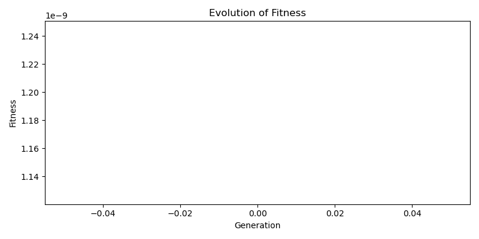

# 🧬 Genetic Algorithm for Keyboard Layout Optimization

**A data-driven approach to evolving optimal keyboard layouts using empirical typing performance measurements.**



This repository implements a Genetic Algorithm (GA) system that optimizes keyboard layouts based on real typing performance data collected from human participants. The system minimizes corpus typing time by evolving arrangements of 46 physical key symbols using measured unigram, bigram, and optional trigram timings.

---

## 🎓 Project Background

This project is part of the **BagreType** research initiative, developed by:

- **Samuel Marcio Fonseca Santos** (RA: 30599661)
- **João Pedro de Souza Letro** (RA: 25851691)

8th semester students at **Universidade de Franca (UniFran)**  
Graduation Project (TCC)

### Related Projects

- **🌐 BagreType Platform**: [bagretype.com](https://bagretype.com) - Web platform for collecting typing performance data from participants
- **📦 BagreType Repository**: [github.com/SamuelMFS/BagreType](https://github.com/SamuelMFS/BagreType) - Main project repository with data collection system

### Documentation

- **📄 Technical Overview (English)**: [Article.md](Article.md) - Comprehensive technical specification
- **📄 Visão Técnica (Português)**: [Article_pt_BR.md](Article_pt_BR.md) - Especificação técnica completa

---

## 🎯 Overview

The keyboard layout optimization problem involves searching through **46! ≈ 5.5×10^55** possible permutations—a space so large that exhaustive enumeration is computationally infeasible (see [Article.md](Article.md#13-search-space-complexity) for detailed analysis). This system uses a Genetic Algorithm to efficiently discover high-quality layouts by:

1. **Parsing empirical timing data** from [BagreType](https://bagretype.com) to construct probability distributions over typing latencies
2. **Computing corpus-level n-gram frequencies** from target text corpora
3. **Evaluating candidate layouts** via a weighted cost function using these distributions
4. **Evolving populations** through tournament selection, Order Crossover (OX), swap mutation, and elitism
5. **Visualizing results** with fitness evolution plots, per-key cost heatmaps, and timing analysis

---

## 🚀 Quick Start

### 1. Install Dependencies

```bash
python -m venv .venv
source .venv/bin/activate  # On Windows: .venv\Scripts\activate
pip install -r requirements.txt
```

### 2. Prepare Data

**Typing Data**: CSV file with a column named `typing_data` containing JSON arrays of timing records. Data can be collected using the [BagreType platform](https://bagretype.com) or provided manually.

**Example JSON structure**:
```json
[
  {
    "sequence": "h",
    "letterTimings": [
      {"letter": "h", "reactionTime": 834}
    ],
    "totalSequenceTime": 834
  },
  {
    "sequence": "th",
    "letterTimings": [
      {"letter": "t", "reactionTime": 210},
      {"letter": "h", "reactionTime": 230}
    ],
    "totalSequenceTime": 440
  }
]
```

**Text Corpus**: A text file containing the target corpus for optimization (e.g., Portuguese literature, English articles).

### 3. Run the Optimizer

```bash
python -m ga_keyboard.main \
  --csv /home/xamu/dev/ML/data/typing_test_data_rows\ \(2\).csv \
  --csv-json-col typing_data \
  --corpus /home/xamu/dev/ML/data/machado.txt \
  --generations 300 \
  --population 200 \
  --mutation-rate 0.1 \
  --crossover-rate 0.7 \
  --elitism 5 \
  --use-trigrams false \
  --cost-order bi \
  --fallback-to-unigrams false
```

### 4. View Results

Outputs are saved to `outputs/`:
- `best_layout.txt` - ASCII rendering of the optimized layout
- `fitness.png` - Evolution of fitness across generations
- `heatmap.png` - Per-key cost visualization
- `unigram_timing_heatmap.png` - Average unigram timing per physical key
- `bigram_timing_heatmap.png` - Average bigram timing per physical key
- `corpus_character_frequencies.txt` - Character frequency statistics

---

## 📊 Features

### Data Integration
- **BagreType Data Collection**: Integrates with typing performance data collected via [bagretype.com](https://bagretype.com)
- **Flexible Data Sources**: Supports CSV files with JSON timing arrays
- **Data Mixing**: Option to merge datasets using `--mix-with-typing-test` flag

### Algorithm Components
- **Tournament Selection**: Tunable selective pressure via tournament size
- **Order Crossover (OX)**: Provably correct permutation crossover operator
- **Swap Mutation**: Local search with configurable mutation rate
- **Elitism**: Preserves best individuals across generations

### Visualization
- **Fitness Evolution**: Track convergence across generations
- **Timing Heatmaps**: Cyan-gradient heatmaps showing per-key timing costs
- **Cost Analysis**: Per-key cost approximation for evolved layouts
- **ASCII Layout Renderer**: Human-readable keyboard layout visualization

### Cost Function
- **N-gram Support**: Unigrams, bigrams, and optional trigrams
- **Flexible Cost Orders**: Choose which n-gram order to use exclusively (`--cost-order uni|bi|tri`)
- **Graceful Missing Data**: Configurable backoff strategies for sparse timing data

---

## 🔧 CLI Options

```bash
python -m ga_keyboard.main [OPTIONS]

Required:
  --csv PATH              Path to CSV file with typing data
  --corpus PATH           Path to text corpus file

Optional:
  --csv-json-col NAME     Column name with JSON timing array (default: typing_data)
  --generations N         Number of evolution generations (default: 300)
  --population N          Population size (default: 200)
  --mutation-rate FLOAT   Mutation probability per individual (default: 0.1)
  --crossover-rate FLOAT  Crossover probability (default: 0.7)
  --elitism N             Number of elites preserved (default: 5)
  --use-trigrams BOOL     Enable trigram optimization (default: false)
  --cost-order ORDER      Which n-gram order to use: uni|bi|tri (default: bi)
  --fallback-to-unigrams  Enable additive backoff for missing timings
  --mix-with-typing-test  Merge with typing_test.csv before processing
  --seed N                Random seed for reproducibility (default: 42)
  --outdir PATH           Output directory (default: outputs/)
```

---

## 📐 Algorithm Details

### Search Space
- **Size**: 46! = 55,026,221,598,120,889,498,503,054,288,002,548,929,616,517,529,600,000,000 (≈ 5.5×10^55)
- **Complexity**: Approximately 19 orders of magnitude larger than all computational operations possible since the Big Bang (see [Article.md](Article.md#13-search-space-complexity))

### Fitness Function
The expected typing time for a corpus under layout `L`:

$$
C(L) = \sum_i f(u_i) \cdot E[T|\phi(u_i)] + \sum_j f(b_j) \cdot E[T|\phi(b_j[0])\phi(b_j[1])] + \sum_k f(t_k) \cdot E[T|\phi(t_k[0])\phi(t_k[1])\phi(t_k[2])]
$$

Fitness is the inverse of cost:
$$
\text{fitness}(L) = \begin{cases} 
1 / C(L) & \text{if } C(L) > 0 \\
0 & \text{otherwise}
\end{cases}
$$

See [Article.md](Article.md#3-fitness-and-cost-function) for detailed mathematical formulation.

---

## 📁 Project Structure

```
ga_keyboard/
├── __init__.py              # Package exports
├── layout.py                # Canonical key definitions, ASCII rendering
├── typing_data.py           # CSV/JSON parsing, timing aggregation, data merging
├── corpus.py                # Corpus loading, n-gram counting
├── corpus_stats.py          # Character frequency analysis
├── fitness.py               # Cost computation, fitness evaluation
├── ga.py                    # Population init, selection, crossover, mutation, evolution
├── viz.py                   # Heatmaps, plots, sparklines
└── main.py                  # CLI entrypoint, orchestration

scripts/
├── generate_synthetic_typing_csv.py  # Generate synthetic timing data for testing
└── fuse_typing_csvs.py               # Merge multiple typing CSV files

data/                         # Input data directory
outputs/                      # Generated results directory
```

---

## 🧪 Synthetic Data Generation

For testing and development, synthetic timing data can be generated:

```bash
python scripts/generate_synthetic_typing_csv.py \
  --out data/synthetic_typing.csv \
  --row-base-numbers 220.0 \
  --row-base-top 170.0 \
  --row-base-home 140.0 \
  --row-base-bottom 180.0 \
  --noise-std 0.0 \
  --seed 1234
```

This generates a complete dataset with all 46 unigrams and 2,116 bigrams (46×46) with realistic timing values based on key positions.

---

## 📚 References

- Goldberg, D. E. (1989). *Genetic Algorithms in Search, Optimization, and Machine Learning*. Addison-Wesley.
- Davis, L. (1991). *Handbook of Genetic Algorithms*. Van Nostrand Reinhold.

---

## 📝 License

This project is developed as part of the Graduation Thesis at Universidade de Franca (UniFran).

---

## 🤝 Contributing

This is an academic research project. Contributions and suggestions are welcome!

For questions or collaboration inquiries, please refer to the main [BagreType repository](https://github.com/SamuelMFS/BagreType).

---

## 📧 Contact

- **Samuel Marcio Fonseca Santos**: [GitHub](https://github.com/SamuelMFS)
- **João Pedro de Souza Letro**: Co-author
- **Project Website**: [bagretype.com](https://bagretype.com)
- **Main Repository**: [github.com/SamuelMFS/BagreType](https://github.com/SamuelMFS/BagreType)
